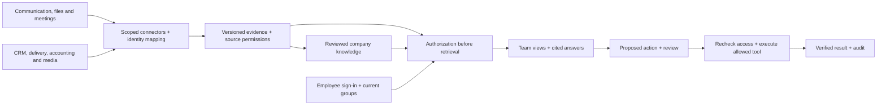

# AI Company Operating System Template

**Company knowledge, connected tools, and coordinated work—with access that follows each person.**

A tool-agnostic reference project for turning a personal AI operating-system idea into a company-owned product. Employees get a shared place to understand customers, meetings, files, projects and decisions. Leaders get a broader business view. Each person sees only the evidence they are allowed to access.

**Release: 0.1.3 reference demo + enterprise build specification.** Run a working fictional-data demonstration today. Use the implementation guides to scope and build a real customer deployment. Live connectors, company sign-in, model generation and production infrastructure are future implementation work; the status table below is the contract.

For a plain-language introduction, read [what it does and why it exists](docs/00-overview.md). For the complete documentation, start at [the documentation README](docs/README.md).

## What this helps a company do

- Prepare for a customer conversation using authorized CRM, call and delivery evidence.
- Turn meetings into reviewed decisions and proposed work, with traceable sources.
- Keep company context, project history and account knowledge organized and current.
- Give Sales, Finance, People, Operations, Marketing, Customer Success and leadership appropriate views.
- Connect existing systems through a common adapter contract, with clear data ownership.
- Operate under company identity, billing, policies and support ownership rather than depending on one employee's personal assistant account.

This system sits above existing tools. CRM remains authoritative for opportunity records; accounting remains authoritative for financial reports; project tools remain authoritative for delivery status. Company OS provides governed retrieval, maintained knowledge and controlled workflow execution.

## Why a company can own and replicate it

The design moves shared knowledge, access decisions and workflows into a company-operated service. An employee opens a browser and signs in with their company identity. The backend retrieves authorized evidence, uses the company's approved model access, saves reviewed work and runs scheduled jobs on managed infrastructure. Closing the original builder's laptop or offboarding that person must not stop the service.

| Company-owned foundation | What it makes independent of a personal AI setup |
|---|---|
| Repository and release process | The team can inspect, change, deploy and maintain the software |
| Hosting, database, object storage and job runtime | Data and scheduled work persist outside an individual's chat history or laptop |
| Employee identity and source permissions | Each person receives appropriate access rather than inheriting one developer's connections |
| Source applications and model accounts | Integrations and usage are governed and billed by the company |
| Reviewed knowledge, suggestions and audit records | Context and decisions remain available with provenance and controlled audiences |
| Named operators, backups and handover | The company can recover, rotate credentials and continue when people leave |

A personal coding assistant can help an engineer build this. The proposed deployed product does not require employees to share that assistant account, its subscription, its local files or its personal connections. An agent runtime can be one replaceable implementation component; the company's data and authorization rules must remain independently owned and enforced. [Accounts, APIs and subscriptions](docs/12-tools-apis-and-subscriptions.md).

**Replication means implementing a chosen stack from this template and proving it works for the customer's sources.** Fork or download the repository; select managed services, an existing cloud or a hybrid; prepare the data and recording flow; implement company sign-in and selected adapters; then pass the permission, recovery and delivery checks. The working demo establishes reference behavior. The production guides specify the engineering and operating work still needed.

## Start here

| You want to… | Read / use |
|---|---|
| Identify required tools, APIs, accounts and subscriptions | [Setup requirements](docs/12-tools-apis-and-subscriptions.md) |
| Start from scratch or reuse AWS/Azure | [Three deployment paths](docs/13-deployment-paths.md) |
| Choose Vercel, Supabase, Trigger.dev, n8n or a hybrid stack | [Platform options and concrete combinations](docs/15-platform-options-and-hybrid-stacks.md) |
| Choose database, worker and automation services | [PostgreSQL / Supabase](docs/17-postgres-and-supabase-options.md) and [jobs / automation](docs/16-jobs-and-automation-options.md) |
| Understand where data and suggestions are stored | [Storage and lifecycle](docs/14-data-storage-and-lifecycle.md) |
| Understand the product in business terms | [Concept](docs/01-concept.md) and [team views](docs/02-product-and-teams.md) |
| Prepare messy company data and record customer calls | [Data readiness and delivery playbook](docs/08-data-readiness-and-delivery.md) |
| Try the fictional product | Run the demo below, then follow [the walkthrough](docs/09-github-and-demo.md#run-a-local-demo-for-a-company) |
| Connect your existing tools | [Integration catalog and contracts](docs/04-integrations.md) |
| Evaluate architecture and access | [Architecture](docs/03-architecture.md) and [security](docs/05-security.md) |
| Plan deployment and ongoing operations | [Deployment](docs/06-deployment.md) |
| Scope a funded pilot | [Roadmap, staffing and economics](docs/07-roadmap-and-economics.md) |
| Publish this repository | [GitHub instructions](docs/09-github-and-demo.md) |
| Know exactly what the starter implements | [Implementation handoff](docs/10-implementation-handoff.md) |

## What a company needs to run it

For the **local fictional demo**, a computer, Python and a browser are enough. A personal AI subscription is optional development help.

For the **proposed shared production service**, arrange company identity, application hosting, a database, private file storage, background jobs, secrets, monitoring/backups and an approved model runtime. Connect only the existing business tools needed for the selected workflows. Source APIs require their own approved access; a personal assistant login does not supply those grants or the cloud infrastructure. [Full tools/API/account checklist](docs/12-tools-apis-and-subscriptions.md).

| Starting point | Delivery approach |
|---|---|
| Starting from scratch | Establish company-owned accounts and an operator, then use a small managed-cloud setup or a dedicated managed delivery service |
| Existing AWS | Fit into existing accounts, networks, identity and CI; candidate services include ECS/Fargate, RDS, S3, SQS and Secrets Manager |
| Existing Azure | Fit into existing tenant/subscription, networking and CI; candidate services include Container Apps, PostgreSQL, Blob, Service Bus and Key Vault |
| Managed application services | Evaluate Vercel + hosted Supabase + Trigger.dev, with n8n where visual integrations help |
| Existing cloud with selected managed services | Host the interface on Vercel, keep the policy API/database/files in AWS or Azure, and choose where jobs execute |

These are implementation paths, not cloud deployments included in this release. The [step-by-step deployment guide](docs/13-deployment-paths.md) specifies tools, administrators, work sequence and acceptance evidence.

**The components are interchangeable by responsibility.** PostgreSQL is the database engine; Supabase bundles PostgreSQL with backend services. Vercel can host the application interface and suitable endpoints. Trigger.dev and n8n offer different ways to implement background work and integrations. Use the [stack selection guide](docs/15-platform-options-and-hybrid-stacks.md) to choose what the company needs, document where data is processed and retain existing cloud investments. These tools do not automatically supply source permissions or complete the planned integrations.

**Yes, the production design stores selected data and saved suggestions.** Use company-controlled database/object storage for authorized evidence, maintained knowledge, scoped draft suggestions, approvals and workflow history. Keep original business systems authoritative. Save suggestions through explicit user action or configured workflows, with citations, review state and retention. Unsaved chat is session-only by proposed default; provider processing has separate controls. [Storage decisions and lifecycle](docs/14-data-storage-and-lifecycle.md).

## Run locally

Requires Python 3.11 or newer. No package installation, cloud account, API key or AI subscription is needed for the fictional demo.

```bash
cd ai-company-operating-system-template
python3 -m app.server
```

Open **http://localhost:8080**. If that port is busy, use `python3 -m app.server --port 8081` and open the corresponding address. Stop with Control-C.

The demo deliberately lets you switch fictional people. It uses no real authentication and must stay on your computer with fictional data. The server rejects non-localhost Host values. Production identity must replace the demo selector/header before any real company deployment.

An optional local container setup is included:

```bash
docker compose up --build
```

The container port is published only on `127.0.0.1`. This configuration is for the same fictional demo. Its container build has not been verified in the authoring environment.

## A five-minute walkthrough

1. Start as **Alex Morgan / Chief executive**. Explore the company brief, then ask “What does Atlas need before renewal?” The demo returns accessible evidence with source links.
2. Switch to **Jordan Lee / Account executive**. Sales records remain available; finance and restricted People records disappear. The compiled Atlas brief also requires Customer Success source access, so Sales alone cannot read it.
3. Switch to **Sam Rivera / Finance director** and ask about cash. The fictional approved report records its entity, currency and date. Switch to **Jamie Park / Team member**; that report is unavailable.
4. Switch to **Casey Brooks / People partner** to see the synthetic restricted People case. Neither the CEO nor the IT administrator gets an automatic override.
5. As Jordan, propose a task from the Atlas CRM record. Switch to Alex to approve it and run the simulation. The record changes from `proposed` to `approved` to `simulated`; no external application is modified.

The evidence preview is deterministic keyword matching, not model-generated analysis. Documents and source labels are fixtures; no provider is connected.

## Implemented versus planned

| Capability | In this repository | Production work |
|---|---|---|
| Team experience | Nine fictional personas; overview, knowledge, workflows, connection catalog and access explanation | Company SSO, provisioning, saved preferences and customer configuration |
| Permissions | Server-side tenant/grant/deny checks; derived-source intersection; missing/expired/deleted source denial | Real source ACL sync, live checks, group lifecycle, field/row policies, production RLS and enforcement tests |
| Knowledge | Thirteen fictional records, source lineage, source drawer, authorized search/citations | Parsing, extraction, embeddings/hybrid retrieval, compiled knowledge review and versioning |
| AI | Deterministic authorized evidence preview | Organization-owned model gateway, model routing, evaluations, budgets and data-processing controls |
| Connections | Vendor-neutral Python protocol and planned adapter catalog | OAuth/service identities, backfill, incremental sync, revocation and provider contract tests |
| Customer calls/media | Capture playbook, quality checklist and sample record contract | Actual recording-provider connections, transcription/OCR, storage, consent/policy enforcement and secure playback |
| Actions | Local task proposal, separate-person approval, source/access recheck, idempotent simulation | Allowlisted provider writes, destination audience checks, durable workers, execution receipts and compensating actions |
| Readiness | Inventory/context templates and a local declaration validator | Customer evidence collection and independently verified acceptance tests |
| Operations | Local SQLite workflow/audit state, test suite, CI configuration, local Docker files | Cloud infrastructure, secrets, monitoring, backup/restore, incident response and enterprise support |

Tests demonstrate selected behavior of this reference implementation. They do not establish production security or compliance. Fixture ACL expiry is deliberately long-lived to keep the example usable; real deployments require source-specific short permission freshness windows and verified revocation handling.

## How the production system fits together



Every derivative—including a summary, graph edge, embedding, cached answer or scheduled briefing—needs provenance and an enforceable audience. Combining an accessible sales call with a restricted finance report does not make the finance information available to Sales. A CEO can receive comprehensive authorized business intelligence while private employee or legal records remain separately controlled.

The broad integration strategy is **one common contract, multiple tested adapters**. “Any company can adapt it” does not mean every vendor is already supported. A customer installs the adapters that match its tools and the selected workflows; each adapter must prove its permission and lifecycle behavior.

## Get the data flow ready

Use the [full playbook](docs/08-data-readiness-and-delivery.md) before connecting production data:

1. Inventory tools, business entities, records, owners and source-of-truth decisions.
2. Establish company identity and map people/groups to source-system identities.
3. Set up approved capture of customer calls and meetings, with transcripts, speakers, timestamps, owners and source links.
4. Normalize accounts, opportunities, projects and meeting identifiers; flag uncertain matches for review.
5. Keep original evidence versioned; publish readable summaries with provenance, audience and review dates.
6. Prove allowed and denied access, deletion, revocation and freshness on representative records.
7. Run a bounded read-only pilot, then add reviewed actions and recurring work.

Templates: [system inventory](examples/system-inventory.csv), [context intake](examples/context-intake.md), [readiness manifest](examples/readiness-manifest.json), [stack decisions](examples/stack-decision-register.csv), [API access](examples/api-access-register.csv), [retention decisions](examples/data-retention-register.csv).

```bash
python3 -m app.readiness examples/readiness-manifest.json
```

This validates declared metadata locally. A `declarations-complete` result does not prove real permissions, recording consent, connectivity, or production readiness. The example is fictional and uploads nothing. Keep real manifests in customer-controlled private storage.

## Verify the reference implementation

```bash
python3 -m unittest discover -s tests -v
```

The suite checks cross-tenant access, CEO/IT boundaries, inherited permissions, revocation, stale source versions, separate-person approval, idempotent simulation, malformed input, HTTP boundaries and readiness declarations. [Validation record](docs/11-validation.md) distinguishes executed checks from unverified deployment/browser work.

The local database is created at `.local/demo.sqlite3` and ignored by Git. It contains only demo proposals and events; fixture documents live in `app/seed.py`. Tests use isolated in-memory databases.

## Repository layout

```text
app/          Local demo service, reference policy, connector protocol, readiness validator
web/          Accessible vanilla HTML/CSS/JavaScript frontend, no external dependencies
tests/        Policy, workflow, HTTP and readiness checks
docs/         Product, engineering, readiness, deployment and delivery guides
examples/     Fictional manifest and customer intake templates
.github/      CI configuration and connector issue template
Dockerfile    Optional local demo container
compose.yaml  Local-only demo service
```

The public repository contains reusable software, documentation and fictional examples. Each customer's transcripts, files, credentials, deployment state and knowledge stay in that customer's private environment.

## Inspiration and attribution

Nate Herk's [AIS-OS](https://github.com/nateherkai/AIS-OS) informs the context, connections, capabilities and cadence framing. Andrej Karpathy's [LLM Wiki](https://gist.github.com/karpathy/442a6bf555914893e9891c11519de94f) informs the maintained knowledge layer. This enterprise design adds organizational identity, source permissions, provenance, controlled execution and company operations. See [NOTICE](NOTICE.md) for attribution and [the concept guide](docs/01-concept.md) for the distinction between source ideas and this implementation proposal.

Original code and documentation: [MIT license](LICENSE). Contribution expectations: [CONTRIBUTING](CONTRIBUTING.md). Release boundaries: [SECURITY](SECURITY.md).
