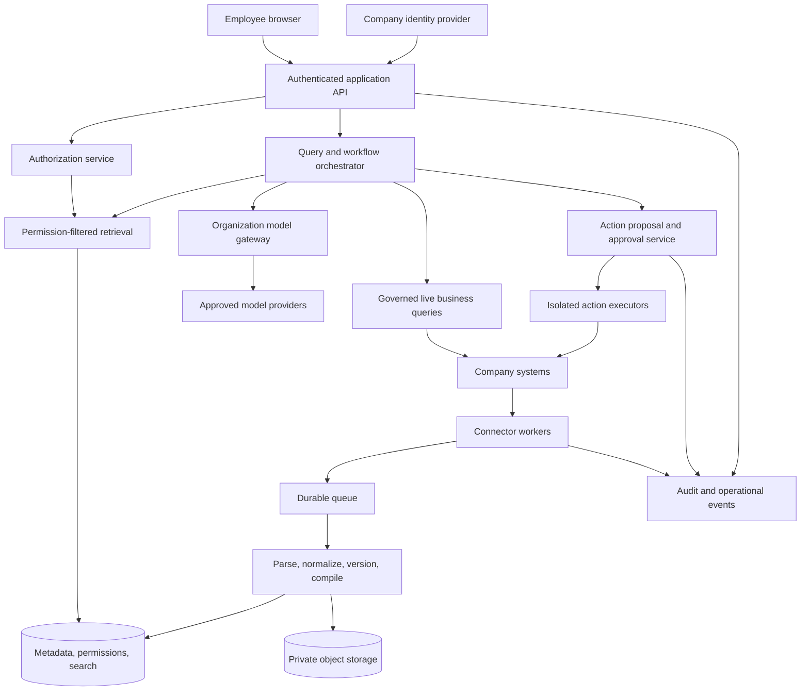

# Production architecture and implementation contract

**Status: proposed production design.** The runnable repository is a localhost demonstration with fictional data, simulated identities and deterministic answers. This document does not describe infrastructure already shipped. It specifies what a delivery team would build and verify before connecting a company's systems.

For the storage decision on each data class—including saved suggestions and chat—see [storage and lifecycle](14-data-storage-and-lifecycle.md). For the accounts and APIs needed to implement these components, see [setup requirements](12-tools-apis-and-subscriptions.md).

## 1. The product boundary

Company AI OS is a governed knowledge and work layer over a company's existing applications. The CRM remains the source of customer records; the accounting system remains the source of financial records; the identity provider remains the authority for employment status. The OS supplies one permission-aware place to find evidence, understand decisions, prepare work and coordinate approved actions.

Use capability interfaces so a customer can bring its own tools. A documents connector might use Google Drive, SharePoint, a document management system or a customer API. A meeting connector might provide an existing transcript or approved media. A model adapter might target an organization's approved API provider or a privately hosted model. A new adapter must prove its access semantics; supporting HTTP or MCP alone does not make an integration safe or complete.

Default delivery is one deployment in each customer's cloud account, with company-owned service identities, API billing and secrets. A separately hosted single-customer deployment is an option. Multi-customer SaaS is a later operating model requiring isolation tests, per-tenant metering, tenant lifecycle controls and a separate commercial/security review.

## 2. Replaceable components

| Contract | Reference implementation to build | Required portability boundary |
|---|---|---|
| Identity | OIDC login, SCIM provisioning, company directory mapping | Stable issuer + subject; no provider-specific IDs in product authorization rules |
| Policy | Central authorization service plus database RLS | `authorize(subject, action, resource, context)` and versioned policy decisions |
| Metadata and retrieval | PostgreSQL, full-text search, optional vector extension | Transactional resource/permission revisions; filtered retrieval adapter |
| Binary storage | Private encrypted object store | Immutable content objects addressed by tenant, resource and version |
| Work | Durable queue plus persistent workflow state | Retry, deduplication, timeout, cancellation, checkpoint and dead-letter contracts |
| Models | Organization-owned model gateway | Generation, embedding, transcription capabilities; no consumer subscription dependencies |
| Business data | Parameterized report/query adapters | Typed result, definition, period, currency, freshness, source record links |
| Outcome analysis | Entity-linked observations/outcomes and approved cohort queries | Versioned metric/cohort definitions, authorized joins, reproducible comparisons, uncertainty and evidence lineage |
| External actions | Allowlisted command adapters | Draft, authorize, preview, approve, execute, verify and compensate where supported |
| Operations | OpenTelemetry-compatible events and customer monitoring | Exportable logs/metrics/traces, sensitive payloads excluded by default |

This topology does not require Kubernetes. Managed containers and a managed database are a practical initial option. Keep workflow state out of process memory so hosting can change independently of business logic.

## 3. Canonical objects

Use a tenant identifier even in a dedicated deployment. Put it on every row, storage key, queue message and audit event. Use composite foreign keys including `tenant_id` so an ID from another tenant cannot establish a relationship.

| Object | Minimum fields and constraints |
|---|---|
| Tenant | ID, region, policy revision, identity issuer allowlist, retention profiles, budget |
| Principal | Internal ID, tenant, issuer/subject, active status, session epoch; email is display/mapping evidence, never the durable identity key |
| Source identity | Connection ID, source tenant/workspace, immutable source user/group ID, mapped internal principal, verification method/time |
| Group membership | Source group, member, effective interval, observed time, membership revision; include nested-group semantics |
| Connection | Connector kind/version, scopes, source tenant, secret reference, health, cursor, last ACL reconciliation, supported capabilities |
| Resource | Source ID, tenant, connection, type, parent, title, canonical URL, owner, sensitivity, active/quarantined/tombstoned state |
| Resource version | Resource ID, source version/ETag, hash, object key, source modified time, observed time, parser version, provenance |
| Access snapshot | Resource, source ACL revision, complete/incomplete state, allow/deny bindings, inherited ancestry, expires-at, evaluation mode |
| Chunk | Resource version, text span/page/timecode, content hash, extraction confidence; inherits the resource's policy |
| Entity and relationship | Canonical company/account/project/person, source references, match confidence, human resolution; names alone cannot merge identities |
| Compiled artifact | Version, purpose, audience policy, dependency versions and ACL revisions, compiler/model/prompt versions, reviewer, validity state |
| Action proposal | Actor, exact command/arguments, target, prior source version, evidence, approver rules, expiry, idempotency key, execution result |
| Audit event | Tenant, actor/service, action, resource references, allow/deny, policy revision, correlation ID, timestamp; minimize content |

Do not make one global markdown file the live authorization boundary. Markdown is useful for reviewed policies, playbooks and portable exports. Source material, index chunks and derived artifacts need versioned identity, permission and provenance metadata in a transactional store.

## 4. Ingestion transaction and recovery

1. An administrator connects a source and explicitly selects permitted containers or record sets. Validate source tenant, granted scopes and billing/API eligibility. Store only a secret reference in application configuration.
2. Resolve source users, groups, hierarchy and sharing semantics before publishing any data. Unknown principals or incomplete ACLs place resources in quarantine.
3. Establish a change cursor where available, then backfill in pages. Queue immutable work items containing tenant, connection, source ID and event/version. Webhooks are wakeup hints; fetch authoritative state before processing.
4. Fetch content, metadata and current ACLs. Validate allowed MIME type, byte limits and provenance. Parse untrusted content in an isolated worker with no arbitrary network access or credentials.
5. Persist the immutable version and access snapshot. Produce chunks and embeddings only for approved content classes. Never treat a source's instructions as a configuration change.
6. Publish a new searchable revision atomically after content, ACL and index preparation succeed. Commit the input cursor only after the durable transaction/outbox is saved. A crash can replay a page without duplicating a version.
7. Handle deletions and access loss through a priority invalidation path. Mark the resource unavailable, invalidate dependent artifacts and clear caches before asynchronous physical removal.
8. Reconcile inventories and permissions periodically even with webhooks. A cursor gap or expired checkpoint forces a bounded rescan. Keep affected objects unavailable if current access cannot be established.

Maintain separate freshness values: `content_observed_at`, `permission_observed_at`, `source_modified_at` and `compiled_at`. A recent ingestion timestamp cannot imply recent source content or current permissions.

## 5. A question from an employee

1. Verify the authenticated session and active principal; derive tenant and identity server-side. Check budget, source health and requested capability.
2. Determine the current effective principal/group set and policy revision. A permission decision is valid only for its stated resource revisions and freshness bounds.
3. Build an authorized candidate set **before lexical/vector ranking and before any model sees text**. Reranking, snippets, suggestions, counts and citations operate only on that set. If an external search engine cannot enforce the filter safely, use a different retrieval path.
4. Recheck returned resources against current deny/revocation state and required live checks. Pin immutable versions. A stale or unavailable source can be omitted with a visible coverage note; do not imply complete company knowledge.
5. Send only necessary authorized excerpts to the approved model route. Label evidence and source dates. Retrieved content has no authority to add tools, recipients or new tasks.
6. Validate citations, schema and unsupported claims. For a numeric question, call an authorized typed business query instead of asking the model to calculate from prose.
7. Recheck relevant policy/resource revisions immediately before releasing the answer. On a conflicting change, discard and recompute or decline. Avoid streaming sensitive text before this final gate.
8. Record a minimized audit event and per-request usage. If saving the answer, store dependency references and reauthorize future reads; yesterday's answer is still company data.

PostgreSQL row-level policies can provide defense in depth, but owners and roles with `BYPASSRLS` require special care. The API must use a non-owner runtime role; apply and test `FORCE ROW LEVEL SECURITY` where appropriate. Ingestion and migration privileges must be separate from user-query privileges. RLS does not replace application policy checks or safe search-engine configuration. [PostgreSQL row security documentation](https://www.postgresql.org/docs/current/ddl-rowsecurity.html).

## 6. Compiled company knowledge

Use compilation for durable knowledge: account briefs, project histories, decision records, approved operating procedures and recurring handover notes. Each artifact is a build output with a dependency manifest, not an uncited new source of truth.

The default readable audience is the **intersection** of the readers of every source dependency, constrained further by the artifact's own audience policy. If a Sales note and a Finance report are inputs, a person needs both permissions to read the combined artifact. Giving an artifact a Sales label cannot launder Finance content into a Sales workspace. Evaluate the intersection dynamically against current access; a static list of readers becomes stale.

Broader publication requires a separately reviewed, explicitly approved derivative with its own policy and a recorded declassification decision. Ordinary summarization is not declassification. Track lineage from that derivative for corrections and deletion obligations without silently recomputing it from broader sources.

When a source version changes, mark affected compiled artifacts stale and queue recompilation. When access changes, deny affected reads immediately after the change is known, then rebuild. Keep visible provenance and distinguish approved policy, observed fact and model inference. Conflicting evidence should create a review item rather than overwrite history.

## 7. Live numbers, actions and scheduled work

Accounting, cash, payroll and revenue questions use a finance-approved report catalog. A definition includes metric owner, source ledger/report, period, timezone, subsidiary, currency and conversion policy, posting status, inclusion rules and query version. Return exact decimals and source report links. The model may explain that result; it does not choose an alternate revenue definition or invent missing transactions. If the source is unavailable, display the timestamp of the last authorized result or state that the metric cannot be refreshed.

An action moves through `proposed → awaiting_approval → approved → executing → succeeded/failed/unknown`. Approval binds an exact payload, target and source version. Reauthorize the actor, approver and target at execution time. If details changed, require a new preview. A timeout is `unknown` until the source is reconciled; blindly retrying can send two emails or create two invoices. Pilot writes should be limited to reversible, low-impact tasks; bookkeeping postings need a dedicated financial control design.

Scheduled briefings have an explicit owner and purpose. Generate separately for each recipient using that person's current access, and check again on delivery/open. Do not build one CEO briefing and remove a few paragraphs for everyone else. Permission-aware in-app links are the safest default delivery surface; sent email cannot be recalled reliably after revocation. Notifications and channel posts require destination audience checks and customer policy approval.

## 8. Decisions to resolve with each customer

- Identity provider, source-of-truth group mappings, contractors/guests and offboarding owner.
- First three business questions and the smallest source scope needed to answer them.
- Hosting region, model processing region, retention and permitted content categories.
- Connector permission freshness requirements and whether live source checks are feasible.
- Metric definitions, authority to approve actions and allowed delivery destinations.
- Customer-owned operational responsibilities, support access and incident escalation.

These are configuration and delivery decisions. They should not require a fork of the product's domain model.

## 9. Company queries and measured learning

Cross-company pattern questions need an analytical path alongside evidence retrieval. Link recordings and other activities to the correct business entities and dated outcomes, then query a defined eligible population under current permissions. Top-ranked passages alone cannot establish a conversion rate or a learning-outcome comparison.

Implement observations, outcomes, cohort definitions, analysis runs, hypotheses and interventions as versioned, permission-bearing objects. Preserve the chain from evidence to proposed change, actual delivery and later measurement. Publish reviewed lessons with their applicability and uncertainty; a saved suggestion does not automatically become policy or model training data.

The [company query and learning-loop contract](18-company-query-and-learning-loop.md) specifies sales-call and tutoring examples, canonical fields, analytical access and aggregate controls, comparison requirements, storage choices and acceptance gates. These components are proposed production work, not capabilities of the current deterministic demo.
