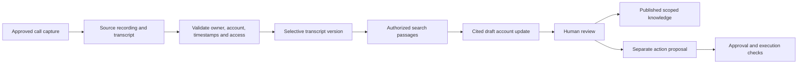

# What is stored, where it lives, and how it is removed

**Status: proposed production design.** Yes: a working Company OS needs its own storage for selected evidence, permissions, maintained knowledge, suggestions and workflow history. It does not need a copy of every company system. The running demo implements only fictional evidence and a small local workflow database; its exact behavior is described at the end of this guide.

The customer owns the production storage account and decides which information may enter it. A managed delivery agreement may let an operator administer that environment, but company data does not belong in the public GitHub repository, a developer's personal AI account or their laptop. Hosting choices are explained in [deployment paths](13-deployment-paths.md). [Tools, APIs and subscriptions](12-tools-apis-and-subscriptions.md#6-what-leaves-the-company-environment) explains provider processing and retention boundaries.

For Vercel/Supabase/Trigger.dev/n8n configurations, use the [hybrid stack guide](15-platform-options-and-hybrid-stacks.md) and [decision register](../examples/stack-decision-register.csv) to record every copy and processing location. Hosted workflow inputs, outputs, errors and checkpoints can create additional retained data even when the main database is in AWS or Azure. See [workflow retention](16-jobs-and-automation-options.md#5-stored-data-editions-and-delivery-model) and [database/object backup differences](17-postgres-and-supabase-options.md#5-connections-backups-and-migration).

## 1. Choose one handling mode for each source

| Mode | What happens | Typical fit |
|---|---|---|
| Reference only | Store an authorized source ID, link, owner, classification and permission metadata. Fetch content only when needed and authorized. Even titles and links require protection. | Restricted documents, large media libraries, systems whose records should remain in place |
| Selective copy and index | Copy only approved text or approved versions from selected folders, channels or record sets. Create searchable passages and, if useful, embeddings. | Operating procedures, delivery records, approved meeting transcripts |
| Controlled live query | Ask an approved, parameterized report endpoint for a specific result. Return its definition, period and freshness. | Accounting balances, revenue, project status and other changing business facts |
| Approved binary copy | Copy an explicitly permitted original or derivative into private object storage, with a retention owner. | Customer call audio needed for transcription, approved training media |

The originating CRM, ledger, file platform and meeting platform remain authoritative for their records. Company OS becomes authoritative for its own review decisions, saved knowledge versions and workflow state. Editing a summary does not edit the original record. A live query is preferable for changing financial figures; copying an entire ledger into search is not the default.

## 2. A plain-language storage inventory

| Information | Default handling to configure | Proposed production location |
|---|---|---|
| Raw recordings and video | Keep at the recording provider. Copy only when approved; temporary transcription input and long-term archive are separate choices. | Source link; approved copies in private object storage |
| Transcripts and meeting notes | Select approved meetings; preserve speaker labels, timestamps, account/project association and corrections. | Text/version metadata in PostgreSQL; longer text objects in private storage |
| File and communication snapshots | Selected content only, with source version, hash, owner and access rules. No blanket import of private messages. | Metadata in PostgreSQL; selected content in private storage |
| Search passages and embeddings | Derived from approved evidence. They inherit its restrictions and deletion policy; embeddings are not anonymous public data. | PostgreSQL full-text search and optional vector index, or approved search service |
| Maintained company pages | Versioned account briefs, decision histories and playbooks, with cited inputs and review state. | PostgreSQL metadata and private versioned content |
| Chat questions and answers | Session-only by default; explicitly saving an answer creates a governed artifact. | Short-lived request/session processing; saved artifacts in customer storage |
| Suggestions and feedback | Store private or scoped drafts, evidence, reviewer decisions and expiry. Do not represent them as established facts. | PostgreSQL |
| Action proposals and approvals | Store exact proposed change, target, actor, approval, expiry, source revisions and outcome. | PostgreSQL; minimal receipt references in audit sink |
| Audit and operational events | Store who did what, when, against which resources, and the policy decision. Exclude full prompts, transcripts and credentials by default. | Separate protected audit sink; sanitized monitoring service |
| Job state and connection cursors | Store progress, retry counts, correlation IDs and source pointers; minimize text inside queues. | Durable queue plus PostgreSQL/workflow store |
| Credentials and encryption keys | Store secret references in application records; actual secrets use a managed vault. | Customer secret/key manager |
| Backups and exports | Encrypted, access-controlled, time-limited copies under a separate recovery policy. Exports require an owner and audience. | Customer backup service/private storage |

Use PostgreSQL for relationships and decisions, object storage for large immutable content, and a secret manager for credentials. AWS candidates are RDS PostgreSQL, S3 and Secrets Manager/KMS; Azure candidates are Azure Database for PostgreSQL, Blob Storage and Key Vault. These are proposed mappings; region, configuration and operational validation belong to the deployment work described in [the cloud topology](06-deployment.md#2-reference-production-topology).

## 3. From a customer call to useful company context



Record the capture method, meeting ID, date/timezone, participants, speaker attribution confidence, account/project IDs, recording notice/consent evidence required by customer policy, and source URL. Preserve timecodes so a reviewer can verify a statement. Quarantine an unclear account match or incomplete source permissions. A transcript correction creates a new version and marks dependent summaries for review. The [data readiness and delivery guide](08-data-readiness-and-delivery.md) covers capture and onboarding.

An ingestion transaction publishes content only after its permissions and source metadata are ready. Extraction, transcription and model providers receive only approved inputs; they are additional processing destinations to record in the customer's data-flow inventory. Keeping the main database in the customer's cloud does not, by itself, keep every processing step there.

## 4. Suggestions, memory and actions are different records

A suggestion such as “schedule a renewal review” is a **draft recommendation**, even if its supporting evidence is accurate. Persist it only when the employee explicitly saves it or an approved workflow is configured to create reviewable suggestions. An ordinary unsaved chat response creates no suggestion record. Store the rationale, citations, uncertainty, intended audience, responsible reviewer and expiry. Give it the states `proposed`, `in_review`, `accepted`, `rejected`, `superseded`, `stale` and `expired`. Record each transition and reviewer; preserve required decision history without indefinitely retaining the entire source text.

Acceptance means a reviewer accepts the recommendation. It does not authorize a tool to create a task, send a message or change a financial record. An accepted recommendation can create a separate action proposal with an exact payload. Execution needs its own authorization, approval rules, expiry, revalidation and verified result. Source changes can make both the recommendation and its associated approval unusable.

The following is an illustrative contract to implement, not a schema implemented by this demo:

```json
{
  "tenant_id": "example-company",
  "suggestion_id": "suggestion-1042",
  "kind": "recommendation",
  "claim_type": "inference",
  "title": "Schedule a renewal review",
  "rationale": "The customer asked for an adoption review before renewal.",
  "status": "proposed",
  "created_by": "approved-model-route",
  "requested_by": "user-218",
  "created_at": "2026-09-17T15:00:00Z",
  "expires_at": "2026-10-17T15:00:00Z",
  "evidence": [{
    "resource_id": "call-704",
    "source_version": "v3",
    "acl_revision": "acl-29",
    "span": {"start_seconds": 184, "end_seconds": 211}
  }],
  "audience_policy": {
    "scope": "account-team-82",
    "require_current_access_to_all_dependencies": true
  },
  "review": {"owner_id": "user-357", "decision": null},
  "generation": {"model_route": "company-approved", "prompt_version": "renewal-v2"},
  "retention_profile": "suggestion-draft-v1",
  "action_proposal_id": null
}
```

Private memory belongs to the employee's authorized workspace. Team memory and company memory require an explicit publish operation, a responsible owner and an appropriate review. Do not silently pool everyone's chatbot conversations into company knowledge. Publishing a page normally narrows its audience; widening beyond the inputs' permissions needs a separately approved derivative and recorded publication decision.

Feedback can correct a page, reject a recommendation or inform a reviewed prompt/evaluation update. It does not automatically retrain a model, change permissions, or send employee feedback into provider training. Any separate training program needs its own approved dataset, purpose and processing arrangements.

## 5. Access stays attached to stored results

Saved answers, recommendations, embeddings and compiled pages retain dependency links and source revisions. By default, the allowed audience is the intersection of current access to all inputs, further narrowed by the saved object's policy. Check current access on every read, search, notification, export and attempted action. A copied summary must not bypass a source restriction.

Revoke access as soon as a local or observed upstream change is known. Deny reads, clear relevant caches, invalidate search entries, stop dependent deliveries and mark affected artifacts unavailable. Incomplete or expired permission evidence fails closed. Upstream changes that have not yet been observed require the source-specific freshness limits described in [security requirements](05-security.md); polling cannot promise instantaneous observation.

Chat processing should discard prompt and answer bodies after the request/session by default, while retaining minimized usage and authorization events. Explicit saved answers follow artifact permissions and retention. Provider-side storage, request logging and retention must be configured and documented separately; an ephemeral application UI does not prove that a provider keeps no copy.

## 6. Retention, deletion and recovery

Complete the [retention register](../examples/data-retention-register.csv) before a real import. Each class needs a business owner, purpose, trigger, approved duration, deletion method, backup policy and any approved hold. The following are illustrative engineering starting points, **not legal requirements or automatic product settings**:

- No permanent raw-media copy; where approved, remove temporary transcription files within 24 hours of successful processing.
- Keep unsaved chat bodies only for the active request/session. Expire unreviewed suggestion drafts after 30 days unless an owner renews them.
- Retain active indexed versions while needed; choose a separate period for superseded versions and approved decision records.
- Propose 365 days for minimized audit events and 35 days for recovery backups, then replace both with the customer's approved policy.

Deletion starts with a tombstone that prevents use. Then purge selected content, passages, embeddings, caches and stored prompt/response copies; invalidate or remove dependent artifacts according to their approved policy. Remove queued payloads and temporary files. Record completion receipts without retaining the deleted text. A source deletion, expired retention period, approved erasure request and connection removal are distinct triggers; each needs defined handling. Disconnecting a source must immediately block its use and prompt the configured purge/hold workflow.

An approved hold suspends applicable physical deletion under restricted access; it must not restore ordinary search visibility. Backups may retain deleted bytes until their documented expiry. A restore must reapply tombstones, holds, current identities and permissions before serving users. Test this sequence. A local deletion cannot recall material already downloaded, emailed or copied into another tool; delivery logs and recipient obligations must address those copies separately.

## 7. What this repository actually stores today

The demo loads users and fictional documents from [`app/seed.py`](../app/seed.py) into memory. It does not ingest recordings, upload customer files, transcribe audio, create embeddings or call a model. Editing demo evidence in memory does not make it a production knowledge store.

The default local database is `.local/demo.sqlite3`. [`app/service.py`](../app/service.py) persists simulated action proposals, approval/status fields and application event rows. Questions and returned evidence-preview answers are not persisted as chat history; a search writes only a generic evidence-search event. The event table is an ordinary editable SQLite table, not an immutable or independently secured audit log. Production storage, retention enforcement, deletion propagation, backups and a separately protected audit sink remain implementation work.
