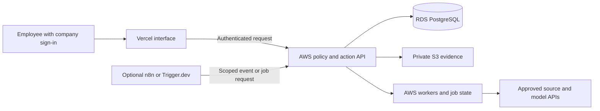

# Platform options: Vercel, Supabase, Trigger.dev, n8n and existing clouds

**Status: proposed implementation choices, checked against official documentation on September 17, 2026.** The repository's runnable component remains the fictional localhost demo. The configurations below are delivery designs, not tested deployments or installed integrations.

Company OS can use these services together, including alongside a company's existing AWS or Azure environment. Choose components by responsibility and permitted data flow. There is no requirement to buy every product or move all existing systems to one provider.

## 1. What each product would do

| Layer | Candidate | Proposed Company OS use | Decision to make |
|---|---|---|---|
| Employee application | Vercel | Website, team views and suitable application/API endpoints | Which requests and confidential responses pass through its runtime? |
| Application database | PostgreSQL through Supabase, RDS, Azure PostgreSQL, Neon or an existing operator | Permissions, evidence metadata, knowledge, saved suggestions, approvals and receipts | Select one authoritative application database and its operator |
| Bundled backend services | Supabase | PostgreSQL plus selected Auth, Storage, Realtime and API capabilities | Which bundled services replace work the team would otherwise implement? |
| Engineering workflows | Trigger.dev | Ingestion, extraction, transcription handoffs, scheduled compilation and retries | Managed execution or a separately operated self-hosted platform? |
| Visual business automation | n8n | Source events, routing, integration workflows and permitted notifications | Which workflows benefit from visual ownership, and which edition/license fits? |
| Existing cloud foundation | AWS or Azure | Core API, private objects, database, workers, secrets and operational controls | What already exists and must remain inside the customer's environment? |

These are suggested responsibilities. Products overlap; the architecture should still assign one owner to each operation. Supabase is a platform built around PostgreSQL, so “Supabase versus Postgres” mixes a service choice with an engine choice. See [database options](17-postgres-and-supabase-options.md). Vercel also offers marketplace database integrations; obtaining a database through that route still requires decisions about its provider, permissions, billing and lifecycle. [Vercel storage options](https://vercel.com/docs/storage).

The permission service belongs in the Company OS application. A Vercel deployment role, Supabase login or n8n project role does not prove that an employee may read a specific customer call. The source identity mapping, access rules and permission freshness described in [security](05-security.md) apply to every stack.

## 2. Four concrete starting configurations

| Configuration | Application and policy API | Database and retained files | Background work | Best reason to choose it |
|---|---|---|---|---|
| A. Managed services | Vercel, with a production API implementation | Hosted Supabase PostgreSQL and private Storage, or another approved object store | Trigger.dev Cloud; optional n8n | Small delivery team and company approval for the participating services |
| B. AWS hybrid | Vercel employee interface; core policy/action API in AWS | RDS PostgreSQL and private S3 | AWS workers; optional approved Trigger.dev or n8n components | Reuse AWS controls while simplifying web delivery |
| C. Azure hybrid | Vercel employee interface; core policy/action API in Azure | Azure PostgreSQL and private Blob | Azure workers; optional approved external or self-hosted workflows | Reuse Azure governance and operations |
| D. Customer-cloud runtime | Application, API and workers in the approved cloud | Existing managed PostgreSQL and private objects | Existing orchestration or deliberately operated self-hosted tools | Processing requirements or operational standards favor one controlled environment |

All four need company sign-in, source integrations, an approved model/transcription route, monitoring and a delivery owner. “Customer-cloud runtime” does not imply that source SaaS or model processing is also inside that cloud. Record those routes separately.

### A. Managed services for a new build

An initial candidate is **Vercel + hosted Supabase + Trigger.dev**, with n8n added when its visual integrations solve a defined problem. The website calls the policy API; the API reads authorized evidence and saves suggestions; jobs process new artifacts and publish reviewed context. Supabase can bundle backend capabilities, but the builder must implement the company permission model and connect the chosen identity provider.

Choose one workflow system initially if it covers the pilot. Avoid adding n8n merely to forward every Trigger.dev call, or maintaining duplicate databases in Supabase and RDS. The company should own the provider organizations, repository, billing and recovery access. A delivery partner can receive a scoped operational role.

### B. Vercel with an existing AWS environment

Keep the core policy/action service, RDS and S3 in the company's AWS account. Vercel can serve the interface and, if approved, a small server-side layer that forwards authenticated requests. That layer sees the request and response content it handles; it is part of the processing inventory.

The optional external workflow should receive only what its task requires. If transcripts must remain within the customer runtime, let it submit an opaque event ID while an AWS worker performs processing. If a Trigger.dev Cloud worker downloads and summarizes the transcript, that processing happens in the managed service's environment even though the original file remains in S3. [Workflow deployment and data boundaries](16-jobs-and-automation-options.md).

### C. Vercel with an existing Azure environment

Use the same separation with an Azure-hosted API, Azure PostgreSQL, Blob Storage and approved Azure jobs. Keep company identity and cloud workload identity distinct. An external service may call an authenticated endpoint when permitted; otherwise use customer-hosted workers and an approved network route.

Vercel documents federation with both AWS and Azure for workload access. Bind trust to the intended organization/team, issuer, audience, project and production environment, then grant only required resource permissions. These credentials identify the application workload; the API must independently validate the employee, tenant and requested operation. Federation supplies identity, not a network path or an automatic source-permission system. [AWS federation](https://vercel.com/docs/oidc/aws), [Azure federation](https://vercel.com/docs/oidc/azure).

### D. Keep application processing in the customer environment

Host the UI/API and workers using the customer's supported cloud platform. Reuse its managed PostgreSQL and object storage. Consider self-hosted n8n or Supabase only when their capabilities justify their additional services and operating work. A mature organization can use its existing orchestration platform instead.

Self-hosting a product is a separate delivery project with upgrades, secrets, scaling, recovery and support ownership. It does not automatically provide every feature of the provider's managed service. The [Supabase](17-postgres-and-supabase-options.md) and [automation](16-jobs-and-automation-options.md) guides describe these differences.

## 3. How hybrid connections actually work

Choose and test one network design per boundary:

1. **Authenticated HTTPS application endpoint.** An external web runtime or worker calls the company's narrow API through approved ingress. The API verifies workload and, where appropriate, employee identity; enforces tenant/source access; rate-limits requests; and accesses private databases internally. Avoid exposing a database merely to connect a website.
2. **Supported private networking.** Where required and available, connect the external runtime through the provider's supported private network product. Vercel Secure Compute currently documents AWS VPC peering and is an Enterprise add-on. Confirm region, routing, DNS, runtime support and plan fit. Its static addresses are useful for network rules but do not replace application authentication. Do not assume the AWS peering design applies unchanged to Azure. [Secure Compute](https://vercel.com/docs/networking/secure-compute).
3. **Static interface with browser-to-company API calls.** Vercel can distribute static application assets while the browser calls the company API directly. Design identity, browser reachability, CORS and CSRF controls appropriately. Keep confidential results out of build-time rendering, static files and public caches. Hosting application code still creates a software-delivery trust boundary; inspect analytics, error reporting and other outbound calls before claiming where data flows.

Use an explicit production trust relationship. Preview branches receive synthetic data and separate credentials, not production database access. Never infer a tenant from an unsigned browser field or let a workload token stand in for the employee's current source permissions.

## 4. Put long work in a durable runtime

A call-processing pipeline should return a job reference promptly, then track ingestion, transcript readiness, extraction, permission checks and review asynchronously. Large recordings should go through an authorized private-object upload flow with size/type validation and controlled worker access. Do not route the entire recording through an ordinary web request by default.

Vercel Function execution and request-size limits depend on the supported runtime and plan. Match each task to those limits and use bounded steps or a suitable worker for long processing. [Function limits](https://vercel.com/docs/functions/limitations).

Trigger.dev is one option, not a mandatory dependency. Vercel Workflows also supports durable multi-step execution, retries and waiting for events, with managed state and execution records. Evaluate its retention and processing boundaries alongside the other runtime choices. [Vercel Workflows](https://vercel.com/docs/workflows). The [automation guide](16-jobs-and-automation-options.md) compares Trigger.dev, n8n, Temporal, AWS Step Functions and Azure Durable Functions.

Render is another hosting candidate when a team prefers continuous application workers: its background worker services poll queues without receiving incoming traffic. The application still needs deliberate queue, policy and recovery design. [Render workers](https://render.com/docs/background-workers). These alternatives are candidates to evaluate, not an assertion that all offer equivalent governance, private connectivity or regional coverage.

## 5. Delivery sequence for a selected stack

1. **Record constraints and ownership.** Complete the [stack decision register](../examples/stack-decision-register.csv). Choose regions, data classes, provider organizations, identity administrator, runtime operator and source owners. Decide which services may process transcripts, confidential financial evidence and saved suggestions.
2. **Establish separate environments.** Create company-owned development/staging/production resources and budgets. Install only the chosen platform's development tools and SDKs. Record plans and feature requirements; do not estimate production cost from free-tier demos.
3. **Implement the production foundation.** Replace demo identity, SQLite and the localhost server with verified sign-in, PostgreSQL migrations, persistent object/job adapters and production endpoints. Use separate migration, ingestion, read and action identities. Define the authorization interface before wiring automation.
4. **Connect one complete workflow.** Register one approved recorder/source integration. Receive a verified event, normalize a transcript with timestamps, attach current permissions, produce a cited draft and save it for review. Implement one adapter end to end before adding a large connector catalog.
5. **Configure delivery.** Connect the company repository to the selected hosting/release pipeline. Protect production releases; restrict preview access; keep source credentials server-side. If using Trigger.dev, deploy its task package and environment configuration separately. If using n8n, deploy reviewed workflow definitions and credential references separately. Keep all components' release versions in one delivery manifest.
6. **Prove behavior and hand over.** Test different employee audiences, denied access, revocation during a pending job, duplicate events, source deletion, provider outage, rollback and a timed restore. Check model and platform costs against actual pilot traffic. Deliver the operator and export runbooks from [deployment](06-deployment.md).

The current repo cannot be made production-ready by adding a Supabase URL or importing it into Vercel. Its demo sign-in is intentionally impersonable, and its local persistence is not a shared cloud database. These changes are implementation work with acceptance evidence; the [handoff guide](10-implementation-handoff.md) remains the source of truth for what exists today.

## 6. Buying and operating the combination

Estimate hosting usage, database compute/storage, object operations, network egress, workflow runs/compute/state retention, automation plans, identity features, private connectivity, backups, model/transcription calls and operator time. Include retry and backfill scenarios. An inexpensive web deployment can still have substantial recording storage and cross-provider transfer costs.

For every managed provider, record data processing, log retention, administrator access, deletion/export support and incident ownership. For each self-hosted product, record its license, edition, support and upgrade obligations. n8n's internal company deployment and a product hosting client workflows/credentials have different licensing considerations; review the specific [automation licensing guidance](16-jobs-and-automation-options.md#5-stored-data-editions-and-delivery-model) before selling that delivery model.

Choose the managed configuration when its services and processing boundaries are acceptable and reduce operating work. Choose a hybrid when the existing cloud is the right home for company data and policy services. Choose a customer-hosted runtime when its constraints and operating team support that responsibility. The shared product contract—organized evidence, maintained context, employee permissions and reviewed actions—stays consistent across all three approaches.
