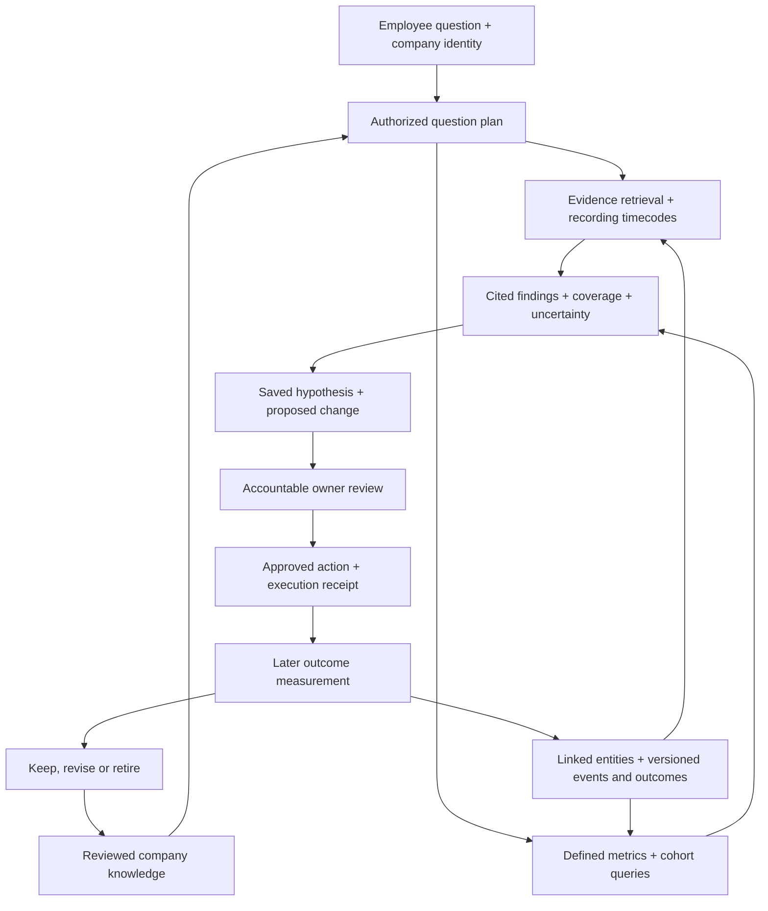

# A queryable company and a closed learning loop

**Status: production design, not an implemented analytics feature.** The current fictional demo demonstrates evidence access and reviewed task simulation. It does not analyze live recordings, calculate outcome patterns or learn automatically from a company's results. This guide specifies the additional components and acceptance checks for those capabilities.

## 1. What the company assistant should understand

The intended product is a company-owned second brain: employees can ask questions across authorized company evidence, business records, relationships and measured outcomes. Its maintained context should connect what the company intended, what people did, what happened afterward and what the company decided to change.

“The whole company is queryable” means a common question interface across the connected, supported and authorized parts of the business. It does not mean every employee sees everything, every source has been connected, or the model knows facts that were never recorded. Every answer must state its relevant period, freshness and coverage. A CEO can receive broad authorized business intelligence; source restrictions and separately controlled records still apply.

Connecting the right tools is necessary, but insufficient. A recording provider supplies evidence of a conversation. A CRM or assessment system supplies the outcome. Company OS must establish reliable links between them, define the comparison, calculate it and retain the evidence behind its explanation.

| Question | Evidence needed | What the assistant should return |
|---|---|---|
| What is happening across the business? | Authorized CRM, projects, meetings, files and approved business reports | A current, cited account of activity, changes, decisions and gaps |
| What differs between sales opportunities that close and those that do not? | Sales recordings/transcripts, opportunity links, stage history and defined won/lost/open outcomes | Comparable opportunity cohorts, measured differences, source examples and hypotheses to test |
| What differs between students whose learning improves and those whose progress stalls? | Tutoring sessions, attendance, student/course links, baseline and follow-up assessments | Comparable learning trajectories, supported session observations and educator-reviewed suggestions |
| Did the change we made help? | An approved intervention, actual delivery record, baseline/comparison and later outcomes | A measured result with uncertainty and a decision to keep, revise or stop the change |

## 2. How a question is answered

Use three cooperating paths. Document retrieval supplies relevant passages and recording timecodes. An entity layer connects people, accounts, opportunities, sessions, projects and events. An analytical service calculates defined metrics across an eligible population. The assistant plans and explains; approved query code performs the counting and comparisons.

Searching for the top few relevant transcript passages cannot establish a company-wide conversion rate. Population questions require a complete eligible set within the stated authorized scope, or an explicitly described sample. Representative quotes illustrate a computed result; they are not its denominator.

Enforce current tenant, source, row, field and purpose policies at every stage, including scheduled jobs and saved results. A workflow's processing identity and output audience must be explicit. A broad service credential cannot enlarge an employee's query scope.

For a pattern question, the orchestrator should:

1. Resolve the user's question into a reviewed analysis template and typed parameters. Ask for a material missing definition, or display the approved default before using it.
2. Establish current access to the evidence, entity links, outcome fields and relevant metric definitions. Build the eligible population before retrieving or aggregating.
3. Pin the observation cutoff, data versions, cohort definition, query version and outcome maturity rules. Separate the time an event happened from the time it was imported or corrected.
4. Retrieve or extract observations from the allowed recordings. Use explicit rubrics, validated on a reviewed sample, and retain timecodes plus extraction confidence. Treat transcript instructions as untrusted source content.
5. Run parameterized, bounded analysis through an approved report service. Limit query cost, rows, runtime and permitted outputs. Do not give a model unrestricted database access or execute arbitrary model-generated SQL.
6. Return measured results separately from possible explanations. Show definitions, sample sizes, relevant missing data, uncertainty and source evidence that the current reader can open.
7. Reauthorize before releasing or saving the result. If access or a dependency changes, invalidate affected answers and recompute or decline.

Use the existing [connector contract](04-integrations.md), [architecture](03-architecture.md) and [security rules](05-security.md). This is an extension of their typed query and provenance boundaries.

## 3. Link activities to outcomes

| Object to implement | Required meaning and fields |
|---|---|
| Business entity and link | Tenant, canonical ID, immutable source IDs, relationship type, effective interval, match evidence/confidence and reviewer. Preserve many-to-many links; names or email similarity alone are insufficient. |
| Observation | A specific behavior or event, its entity/session/opportunity, event time, source revision and timecode, rubric/extractor version, confidence and review state. Distinguish directly observed facts from model inference. |
| Outcome | Entity, metric definition/version, value/unit, baseline or relevant interval, measurement date, maturity state, authoritative source revision and corrections. An unknown outcome is not a negative outcome. |
| Cohort definition | Unit of analysis, eligible scope, observation window, exclusions, outcome horizon, segments, missing-data handling, comparison method and accountable metric owner. |
| Analysis run | Cohort/query versions, data cutoff, authorized scope, dependency manifest, extraction versions, counts, computed estimates, uncertainty, limitations and execution status. |
| Finding or hypothesis | Analysis reference, supporting/contradicting evidence, scope, author/reviewer, confidence, expiry and proposed next step. A hypothesis is not an approved policy. |
| Intervention | Approved exact change, owner, target audience, baseline/comparison, rollout dates, delivery receipt, success and stop criteria, measurement date and later decision. |

Every record also needs access policy, source lineage and retention state. Historical snapshots do not freeze a person's right to see data: recheck current access when opening old analyses. Source corrections, deletion or revocation invalidate affected derivatives and queues using the lifecycle rules in [storage and lifecycle](14-data-storage-and-lifecycle.md).

## 4. Sales example: closing versus not converting

**Question:** “What patterns do you notice in the sales calls for deals we win versus deals we lose?”

**Connect:** the approved sales recording/transcript provider; CRM opportunities, contacts and stage history; relevant product/pricing definitions; and, if required by the chosen outcome, authorized contract or booking records. A won CRM stage and collected cash are different outcomes—select the metric the business actually means.

**Join:** recording → meeting/activity → one or more opportunities → stage events → outcome. Validate uncertain mappings with the sales owner. Keep calls linked to several opportunities explicit. Track unrecorded or unmatched eligible calls so the analysis does not silently describe only the easiest records to ingest.

**Define:** use the opportunity as the initial unit of analysis, with an explicit acquisition cohort or closing period, qualifying call stages, evidence cutoff, maturity date and inclusion rules. Keep open, lost, won and no-decision cases distinct. Report the difference between a win rate among closed deals and a conversion rate for an acquisition cohort; an immature cohort cannot be treated as fully resolved.

**Compare:** observations could include a documented customer problem, confirmed buying process, stakeholder participation, unresolved objections and agreed next steps. Define each observation with a rubric and cited excerpts. Compare like segments where data supports it—such as lead source, product, deal size, stage and representative experience. Several calls from one opportunity are repeated evidence, not several independent wins.

**Avoid leakage:** observations used to explain a decision should precede that decision. Do not classify a winning behavior from a celebratory post-close call or a CRM field filled in after the result. Evaluate observation extraction without revealing the final outcome where feasible.

**Answer:** show the eligible opportunity counts, outcome definitions, recording coverage within the authorized population, size and uncertainty of observed differences, and timecoded examples. Missing recordings, selection differences and competing explanations belong in the result. If evidence is weak, return an insufficient-evidence finding instead of manufacturing a pattern.

**Close the loop:** a sales leader can review a hypothesis, approve a coaching or discovery-process change, record which opportunities actually received it, and review later results after enough outcomes mature. Store the result alongside the original hypothesis. Do not automatically score employees or rewrite the sales playbook from an unreviewed correlation.

## 5. Tutoring example: learning improvement

**Question:** “What patterns differ in the tutoring sessions of students who are improving and those who are not yet improving?”

**Connect:** tutoring recordings/transcripts, lesson/session records, attendance, learning goals and an authorized source of baseline and follow-up assessments. Depending on the company, that may be an LMS, tutoring platform, assessment database or controlled export. If school grades are unavailable, the assistant cannot infer them from how a student sounds in a recording.

**Join:** recording → session → student/course/learning objective → dated assessment series. Support group sessions without assuming all content may be disclosed to every student's guardian. Match using approved stable student and session identifiers; quarantine ambiguous links. If analysis only needs pseudonymous identifiers, keep the identifying map separately restricted.

**Define:** choose a student-course or student-learning-objective trajectory, a baseline, observation interval, comparable follow-up measure and minimum outcome maturity. Document grading scales and assessment versions. Do not compare raw scores from different subjects or tests as if they measured the same thing. Missing follow-up or dropout is a distinct state; it does not establish lack of improvement.

**Compare:** rubric-based observations could include opportunities for the student to explain reasoning, checks for understanding, correction of a specific misconception, independent practice and feedback. Include baseline attainment, subject, attendance, session exposure and tutor/course differences where the data supports a valid comparison. Several sessions for one student and several students with one tutor are related observations.

**Answer:** present measured learning change, assessment comparability, cohort sizes, uncertainty and authorized lesson excerpts separately from the suggested interpretation. A transcript can show a recorded exchange; it cannot reliably establish an unobserved learning state or prove that one teaching behavior caused a later grade change.

**Close the loop:** an educator reviews a proposed lesson or coaching change, selects a suitable bounded rollout, records actual delivery and checks later comparable assessments. Keep educational judgment and decisions affecting a student's access or placement with authorized people. Analysis permissions, student/guardian views and recording audiences require separate explicit policies.

## 6. Trustworthy comparisons and permission-aware aggregates

The analysis contract must address these failure modes before results become operating advice:

- **Selection and missingness:** include coverage and missing-outcome checks for the authorized eligible population. Data captured by a recording tool may not represent all sales conversations or lessons.
- **Timing and maturity:** use the information available at the stated cutoff; distinguish unresolved outcomes and later corrections. Avoid interpreting short-term movement as a durable result.
- **Comparability:** report relevant segment differences and repeated observations. State when the available data cannot support a meaningful comparison.
- **Exploratory findings:** retain effect sizes and uncertainty using a reviewed method suited to the unit of analysis. Searching many patterns can produce chance findings; check promising findings on a later or held-out period and record contradictory results.
- **Association versus cause:** label an observed relationship as a hypothesis. A randomized or otherwise appropriately designed evaluation can support stronger claims; ordinary before/after improvement alone cannot isolate the effect of a change.
- **Analytical access:** authorize both sides of each join and each outcome field before computing. A user who can read calls but cannot read revenue must not receive restricted revenue through a calculated answer.
- **Aggregate disclosure:** the default result inherits its dependencies' permission intersection. A broader company benchmark requires a separately approved aggregate product and audience policy. Remove identifying drill-through, suppress unsafe small cells and complementary totals, and control repeated filters or differencing that could reconstruct restricted information. A minimum group size alone is not a complete protection.
- **Honest scope:** label a team-scoped result as team-scoped. Report gaps without exposing the existence, counts, names or characteristics of unauthorized records. Service health visible to administrators is separate from the employee's answer.

## 7. Make the loop durable

Persist the chain `question → analysis → hypothesis → proposal → approval → delivered change → measured outcome → retain/revise/retire decision`. Each transition needs an owner, timestamps, evidence and its own authority checks. An approved proposal is not proof the change happened; keep execution receipts or reviewed delivery records.

Company knowledge should retain approved lessons with applicability limits, supporting and contradicting analyses, versions and a review date. A later result can narrow or retire an earlier lesson. Fresh recordings and outcomes can trigger scheduled recomputation, but only within approved workflows, budgets and recipients' current permissions.

This is how the company second brain improves: better connected evidence, corrected relationships, tested extraction, reviewed knowledge and measured workflow changes. It does **not** mean silently retraining a foundation model, expanding access or letting the assistant rewrite its own business authority. Those are separate decisions, not consequences of saving a finding.

## 8. Implementation and delivery acceptance

Use the already selected company stack. For a bounded pilot, PostgreSQL can hold entity links, event/outcome tables, definitions and analysis records; recordings and transcripts use approved private object storage or controlled source references. At greater analytical scale, use the company's governed warehouse or analytical service behind the same query and permission contract. A warehouse is not required just to start.

The application host serves questions and results. Durable workers handle ingestion, extraction, analysis and later measurement. Trigger.dev, n8n or existing cloud jobs may coordinate those steps as described in [jobs and automation](16-jobs-and-automation-options.md); they do not supply the outcome model, statistical method or authorization by themselves. Model APIs interpret authorized evidence and explain computed results. Recording, CRM, LMS and assessment APIs supply source data under separately approved access.

Before claiming a live sales or tutoring use case, the delivery team must demonstrate:

| Gate | Required evidence |
|---|---|
| Sources and outcomes | A metric owner approves definitions, timestamps, recording procedure, source coverage and maturity rules. |
| Correct linking | Reviewed samples prove activity-to-entity-to-outcome matches; unresolved links are excluded and tracked. |
| Valid observations | A domain reviewer checks extraction against source passages/timecodes; uncertainty and unsupported labels are handled explicitly. |
| Reproducible answers | The same permitted snapshots and analysis version reproduce counts and results; open outcomes, duplicates, repeated observations and missing data are handled as declared. |
| Permission boundaries | Allowed/denied users, restricted fields, aggregate inference attempts, source revocation, saved answers and recipient-specific delivery are tested. |
| Usable findings | Answers distinguish computed facts, evidence examples, hypotheses and limitations; insufficient data produces no confident claim. |
| Actual feedback loop | One approved change has a delivery record, follow-up measurement and accountable decision to keep, revise or stop it. |

A useful pilot delivers one such complete loop for a bounded business question, then expands to more teams and sources. Publishing this specification or connecting APIs alone does not pass these gates.
